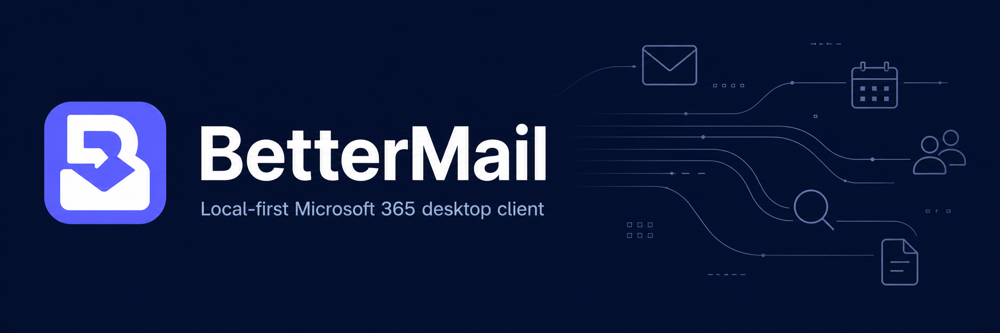
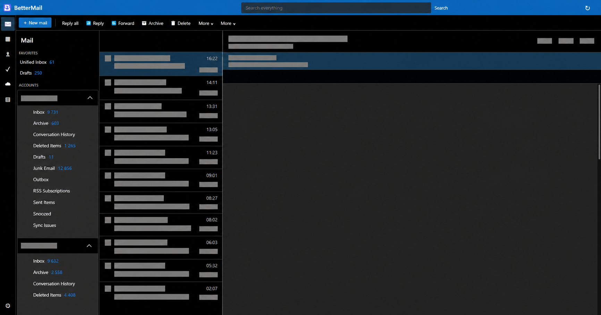
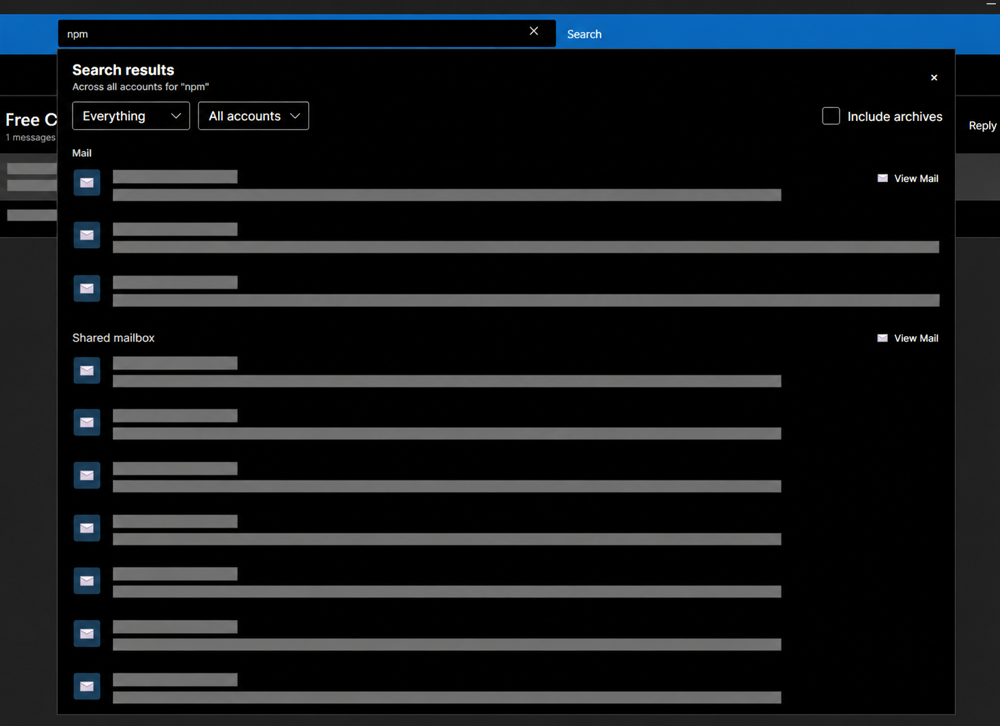
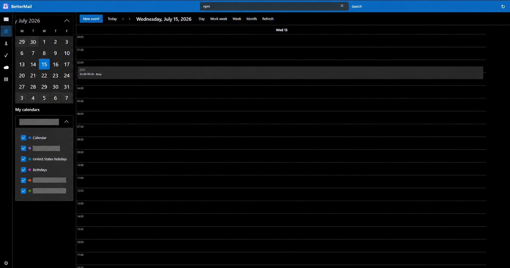
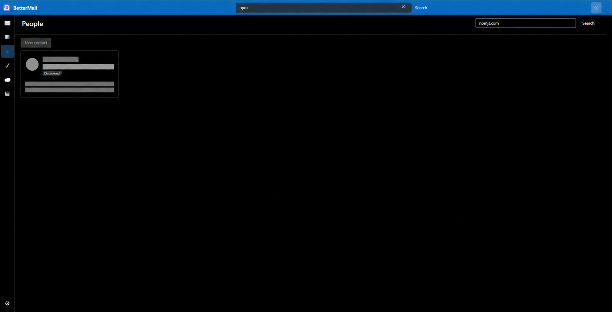
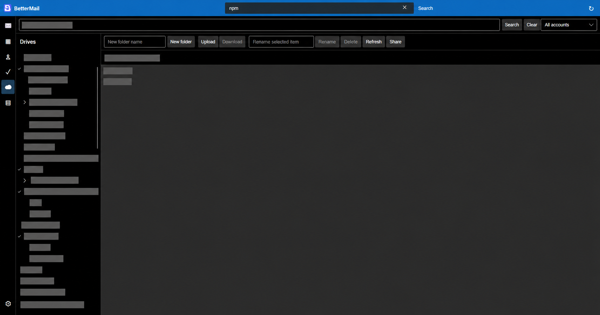

[](https://github.com/BetterCorp/BetterMail/actions/workflows/build.yml)
[](LICENSE)

---

BetterMail is an Outlook-style desktop client built around fast local storage, cross-account
search, and one consistent interface for Microsoft 365. Mail is cached and indexed locally so
selecting messages and searching does not depend on Microsoft Graph round trips.

> [!WARNING]
> BetterMail is under active development. Keep independent backups of important data and
> review changes before using it as your primary client.



*Microsoft 365 mail workspace. Personal and organizational information has been redacted.*

## Highlights

| Area | Current support |
| --- | --- |
| **Mail** | Multiple accounts, unified inbox, shared mailboxes, folder trees, threads, drafts, attachments, reply/forward, archive, delete, junk, flags, and read state |
| **Search** | Encrypted local index, cross-account results, scoped mail/people/files search, folder paths, and archive opt-in |
| **Microsoft 365** | Outlook mail and calendars, People, To Do, OneDrive, OneNote, shared mailboxes, Send As, and Send on behalf |
| **Calendar** | Aggregated calendars, month and timeline views, calendar colours, event availability, and event editing |
| **Files** | Account-relative OneDrive trees, cross-drive search, sharing links, and attaching cloud files to mail |
| **Desktop UX** | Responsive Outlook-style panes, keyboard navigation, F9 sync, background sync, notifications, compact mode, and light/dark/system themes |
| **Security** | Sanitized HTML, blocked remote content by default, encrypted SQLite storage, DPAPI-backed keys on Windows, and secure token caching |

Google Workspace is planned later. Provider-facing mail and workspace capabilities live behind
contracts in `BetterMail.Core`, so another provider can be added without replacing the shell or
local store.

## Screenshots

> [!NOTE]
> Personal, organizational, message, calendar, contact, and file data in every screenshot has
> been permanently replaced with opaque pixels. Public images are flattened PNGs, not blurred
> originals.

### Cross-account search



### Calendar



### People



### OneDrive



## Quick start

### Prerequisites

- .NET SDK 10.0.201 or a compatible .NET 10 patch.
- Windows 10/11, or a glibc Linux desktop supported by Avalonia.
- A Microsoft 365 work or school account.

BetterMail ships with its Microsoft Entra public-client application ID. End users do not need to
create an app registration, configure redirect URLs, or provide a client secret: install the app,
add an account, and sign in.

From the repository root:

```powershell
dotnet restore BetterMail.slnx
dotnet run --project src/BetterMail.App
```

Run the checks:

```powershell
dotnet build BetterMail.slnx -m:1
dotnet run --project tests/BetterMail.Tests
```

Create the older self-contained Windows and Linux development builds:

```powershell
./scripts/publish.ps1
```

Published builds are written to `artifacts/win-x64` and `artifacts/linux-x64`.

## Builds, releases, and updates

`build.yml` runs on `master` and can also be called by the release workflow. It resolves a build
version from the latest stable release as `<release>-build.<run>.<UTC timestamp>`, then builds
Windows, Linux, and macOS in parallel. Master build artifacts are retained for 14 days.

Push a strict semantic-version tag to publish a release:

```powershell
git tag v1.0.0
git push origin v1.0.0
```

`release.yml` runs only for strict `vX.Y.Z` tags. It validates the version, calls `build.yml` with
that exact release version, waits for all three platform builds, and attaches their Velopack
packages to one GitHub release. Installed builds use those release assets for update checks; do
not remove the generated release metadata files.

For a local release package, restore the pinned tool and choose a runtime:

```powershell
dotnet tool restore
./scripts/package-release.ps1 -Runtime win-x64 -Version 1.0.0
```

Supported CI runtimes are `win-x64`, `linux-x64`, and `osx-arm64`. Public production releases
should be code-signed and macOS builds notarized before they are presented as trusted downloads.

## Microsoft sign-in

> [!IMPORTANT]
> **No Microsoft Entra setup is required for normal use.** BetterMail ships with its own
> multi-tenant public-client registration. Install the app, add an account, and sign in.

BetterMail requests the complete delegated permission set when an account is added or
re-authenticated, avoiding separate consent prompts for Mail, Calendar, People, Tasks, OneDrive,
and OneNote.

Tenant policy can still require administrator consent. Shared-mailbox access and Send As or Send
on behalf rights must already be granted by the mailbox's Microsoft 365 administrator.

<details>
<summary><strong>Custom registrations for rebuilt or redistributed clients</strong></summary>

<br>

Developers distributing a custom build can replace the bundled application ID with their own
multi-tenant public-client registration. Configure it with:

- The **Mobile and desktop applications** platform.
- The `http://localhost` redirect URI.
- Public-client flows enabled.
- The delegated Graph permissions listed below.

| Capability | Delegated permission |
| --- | --- |
| Sign-in | `User.Read` |
| Mail | `Mail.ReadWrite`, `Mail.Send` |
| Shared mailboxes | `Mail.ReadWrite.Shared`, `Mail.Send.Shared` |
| Calendars | `Calendars.ReadWrite` |
| People | `Contacts.ReadWrite` |
| Tasks | `Tasks.ReadWrite` |
| Notes | `Notes.ReadWrite` |
| OneDrive | `Files.ReadWrite` |

Do **not** create or ship a client secret. BetterMail is a public desktop client. Override the
bundled registration for a custom build with:

```powershell
$env:BETTERMAIL_MICROSOFT_CLIENT_ID = "00000000-0000-0000-0000-000000000000"
dotnet run --project src/BetterMail.App
```

</details>

## Shared mailboxes

Microsoft Graph cannot enumerate every shared mailbox or determine all effective Send As and
Send on behalf grants. Add a shared mailbox by address under its owning account in **Settings >
Accounts**, then choose the permission already granted by the Microsoft 365 administrator.

Choosing a send mode in BetterMail does not grant Exchange permission. Exchange remains
authoritative and BetterMail validates mailbox access before saving it.

## Local data and security

BetterMail stores its database, preferences, token cache, and cached content under the operating
system's local application-data directory in a `BetterMail` folder.

On Windows, the database is normally:

```text
%LOCALAPPDATA%\BetterMail\mail.db
```

The path is resolved through the operating system rather than hard-coded. The SQLite database is
encrypted; Windows protects its generated key with DPAPI for the current user. On Linux, provide a
strong passphrase because BetterMail will not store an unprotected database key beside the cache:

```bash
export BETTERMAIL_DATABASE_KEY="use-a-long-random-passphrase"
dotnet run --project src/BetterMail.App
```

Remote images remain blocked until explicitly allowed, scripts are removed from HTML mail, and
attachment bytes are loaded on demand rather than permanently retained in the database.

Removing an account deletes its local cache only. It does not delete Microsoft 365 data.

## Project structure

| Project | Responsibility |
| --- | --- |
| `BetterMail.App` | Avalonia desktop shell, workspaces, views, themes, and desktop integration |
| `BetterMail.Core` | Provider contracts, encrypted local store, models, draft reconciliation, and sync engine |
| `BetterMail.Microsoft365` | Microsoft identity, Graph requests, throttling, mail, and workspace adapters |
| `BetterMail.Tests` | xUnit regression and behavior checks |
| `asset-pack` | Canonical logos, desktop icons, web assets, banners, and redacted screenshots |

## Platform notes

- Linux HTML rendering requires WPE WebKit. On Debian/Ubuntu:
  `sudo apt install libwpewebkit-2.0-1`.
- Linux secure token storage requires Secret Service/libsecret.
- Self-contained builds include the .NET runtime and managed dependencies, but platform graphics,
  credential-store, and WebView libraries remain operating-system dependencies.
- This development build is not a compliance-certified release.

## Contributing

Keep changes focused and run the smallest relevant test plus the solution build before submitting
them. For the complete backlog and implementation status, see [TASKS.md](TASKS.md).

Use the structured [GitHub issue forms](https://github.com/BetterCorp/BetterMail/issues/new/choose)
for bugs, feature requests, and support. See [SUPPORT.md](SUPPORT.md) before including diagnostics.

## License

BetterMail is licensed under the [GNU Affero General Public License v3.0](LICENSE), version 3 only
(`AGPL-3.0-only`).
